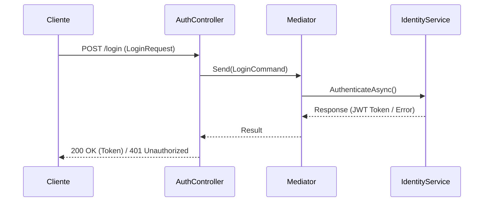

# Flujo de Autenticación (`AuthController`)

El controlador `AuthController` gestiona el inicio de sesión y registro de usuarios dentro de la **API de Cervecería**.

## Endpoints Disponibles

* `POST /api/v1/Auth/login` - Permite a los usuarios autenticarse mediante sus credenciales y obtener un token de acceso JWT.
* `POST /api/v1/Auth/register` - Registra un nuevo usuario en la plataforma.

## Diagrama de Secuencia

## Flujo de Registro

1. El cliente envía los datos de registro (`RegisterUserRequest`).
2. El controlador despacha la orden `RegisterUserCommand` mediante **MediatR**.
3. El servicio de identidad valida que el usuario no exista previamente y persiste el nuevo registro.
4. Se retorna la respuesta correspondiente (`200 OK` o `400 Bad Request`).
