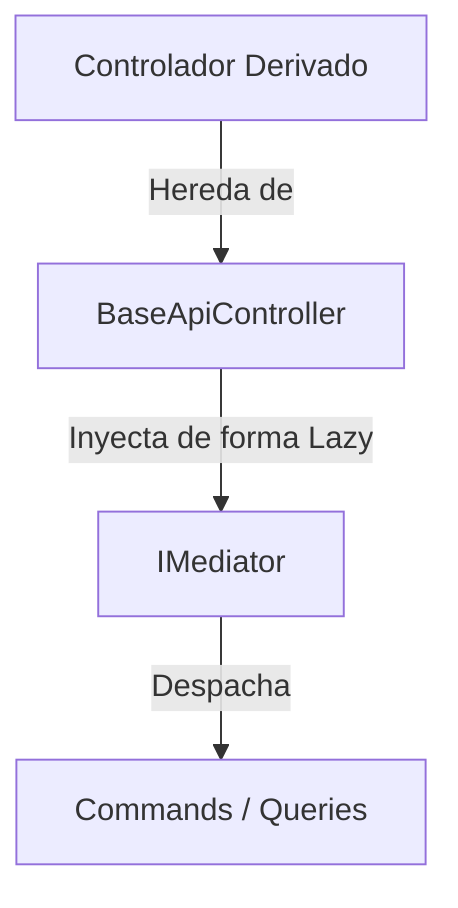

# Flujo de Controlador Base (`BaseApiController`)

El controlador `BaseApiController` actúa como la clase base abstracta de la cual heredan todos los controladores de la versión 1 (V1) en la **API de Cervecería**.

## Descripción y Propósito

Proporciona la infraestructura común para la arquitectura CQRS (Command Query Responsibility Segregation) utilizando **MediatR**, inyectando dinámicamente la instancia del mediador a través del contenedor de servicios (`HttpContext.RequestServices`).

## Características Principales

* **Enrutamiento Estándar**: Configura el atributo `[Route("api/v{version:apiVersion}/[controller]")]` para versionado automático de endpoints.
* **Acceso a MediatR**: Expone la propiedad protegida `Mediator`, la cual resuelve la interfaz `IMediator` bajo demanda (*lazy loading*).
* **Controlador API**: Aplica el atributo `[ApiController]` para habilitar inferencia de bindings y validaciones automáticas de modelo HTTP.

## Arquitectura de Inyección



## Ejemplo de Extensión

```csharp
[ApiVersion("1.0")]
public class EjemploController : BaseApiController
{
    [HttpGet]
    public async Task<IActionResult> Get()
    {
        return Ok(await Mediator.Send(new GetEjemploQuery()));
    }
}
```
