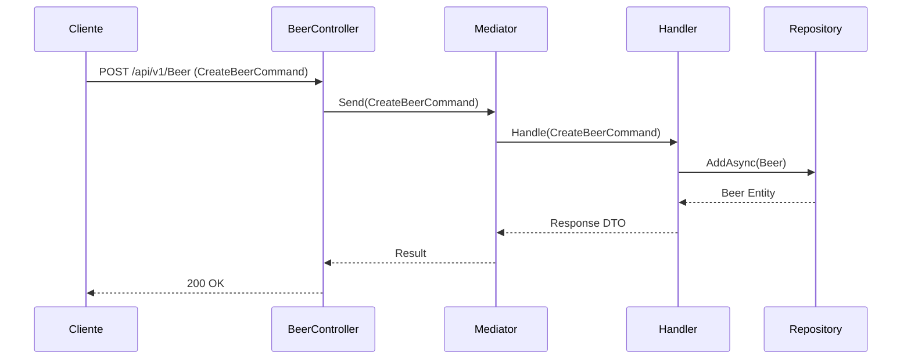

# Flujo de Gestión de Cervezas (`BeerController`)

El controlador `BeerController` expone los endpoints necesarios para la creación, actualización y eliminación de cervezas producidas por cervecerías.

## Endpoints Disponibles

* `POST /api/v1/Beer` - Crea una nueva cerveza en el sistema.
* `PUT /api/v1/Beer/{id}` - Actualiza la información de una cerveza existente.
* `DELETE /api/v1/Beer/{id}` - Elimina una cerveza por su identificador único (GUID).

## Diagrama de Secuencia

## Flujo de Trabajo (CQRS)

1. El cliente envía la solicitud HTTP al controlador con los datos correspondientes.
2. El controlador valida el identificador de la ruta en operaciones de actualización (`PUT`) y despacha la orden (`CreateBeerCommand`, `UpdateBeerCommand` o `DeleteBeerCommand`) mediante **MediatR**.
3. El manejador valida las reglas de negocio, aplica las modificaciones necesarias y persiste las entidades utilizando la capa de repositorios.
