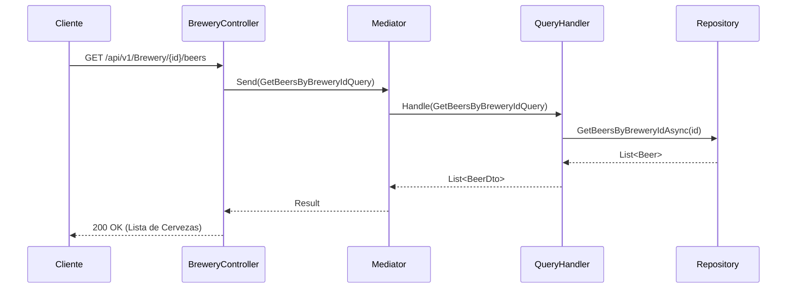

# Flujo de Cervecerías (`BreweryController`)

El controlador `BreweryController` administra la consulta de cervecerías y las cervezas producidas por cada establecimiento.

## Endpoints Disponibles

* `GET /api/v1/Brewery/{id}/beers` - Obtiene el listado completo de cervezas asociadas a una cervecería específica.

## Diagrama de Secuencia

## Flujo de Consulta

1. El cliente consulta las cervezas de una cervecería mediante su ID (GUID).
2. Se envía la consulta `GetBeersByBreweryIdQuery` a través de **MediatR**.
3. El manejador realiza la búsqueda en el repositorio y retorna la lista mapeada a DTOs de respuesta.
