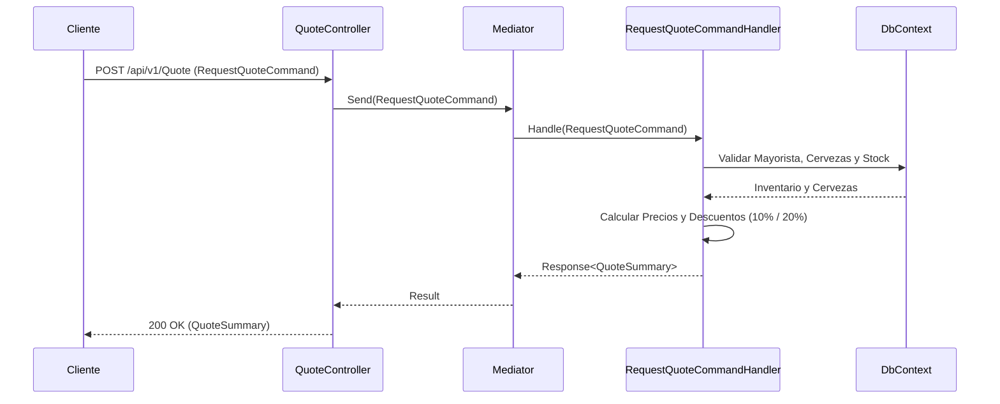

# Flujo de Cotizaciones (`QuoteController`)

El controlador `QuoteController` procesa las solicitudes de cotizaciones de compra de cerveza realizadas por clientes a distribuidores mayoristas.

## Endpoints Disponibles

* `POST /api/v1/Quote` - Solicita una cotización especificando el mayorista y la lista de cervezas con sus cantidades (`RequestQuoteCommand`).

## Estructura de la Solicitud

```json
{
  "wholesalerId": "3fa85f64-5717-4562-b3fc-2c963f66afa6",
  "items": [
    {
      "beerId": "7cb45f64-5717-4562-b3fc-2c963f66afa1",
      "quantity": 12
    }
  ]
}
```

## Diagrama de Secuencia



## Reglas de Negocio Aplicadas

1. **Validación del Pedido**: El pedido no puede estar vacío ni contener elementos duplicados (`BeerId`).
2. **Existencia del Mayorista**: El `WholesalerId` debe pertenecer a un mayorista registrado.
3. **Validación de Productos y Cantidades**: La cantidad debe ser mayor a 0 y la cerveza debe ser vendida por el mayorista especificado.
4. **Verificación de Stock**: La cantidad solicitada no puede superar la existencia actual en el inventario del mayorista (`StockQuantity`).
5. **Descuentos por Volumen**:
   * **10% de descuento** si el total de unidades es superior a 10 (11 a 20 unidades).
   * **20% de descuento** si el total de unidades es superior a 20 unidades.
