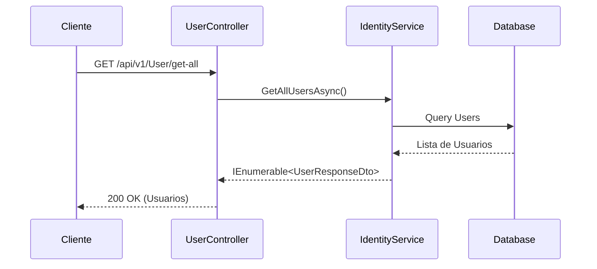

# Flujo de Gestión de Usuarios (`UserController`)

El controlador `UserController` proporciona endpoints administrativos para gestionar el ciclo de vida y estado de los usuarios en la **API de Cervecería**.

## Endpoints Disponibles

* `GET /api/v1/User/get` - Obtiene los detalles de un usuario específico mediante su identificador.
* `GET /api/v1/User/get-all` - Retorna el listado completo de usuarios registrados en el sistema.
* `PATCH /api/v1/User/update` - Actualiza parcialmente la información del perfil del usuario.
* `PATCH /api/v1/User/toggle-active` - Cambia el estado del usuario entre activo e inactivo.
* `DELETE /api/v1/User/delete` - Elimina un usuario registrado en la base de datos de identidad.

## Diagrama de Secuencia

## Flujo de Operaciones Administrativas

1. **Consulta de Usuarios**: Permite obtener la lista global o un usuario individual mapeado a su modelo DTO.
2. **Modificación de Estado (`toggle-active`)**: Permite deshabilitar temporalmente a usuarios sin eliminar su historial de pedidos o cotizaciones.
3. **Eliminación**: Remueve el registro de identidad del usuario tras validar los permisos administrativos requeridos.
