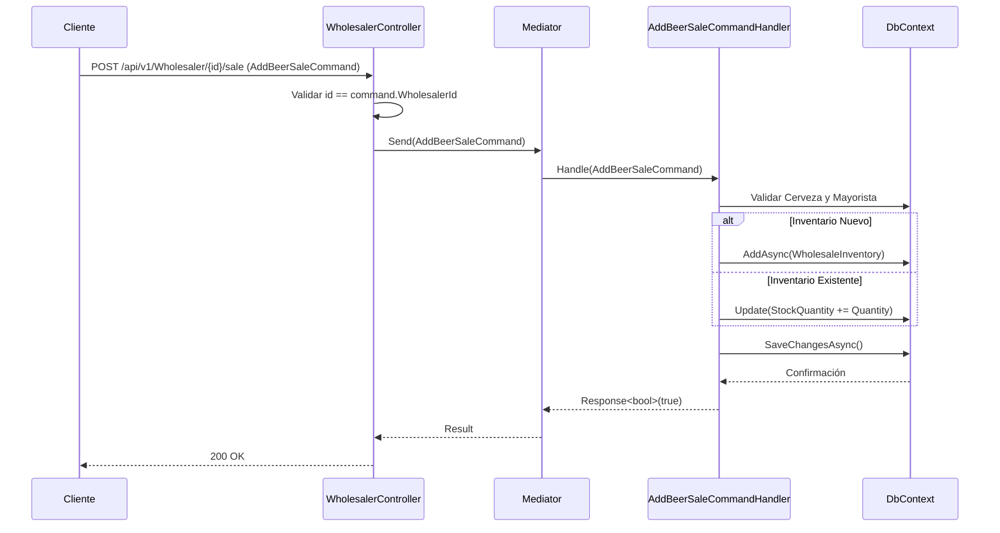

# Flujo de Distribuidores Mayoristas (`WholesalerController`)

El controlador `WholesalerController` gestiona el inventario de cervezas y la venta o reabastecimiento de stock en los distribuidores mayoristas.

## Endpoints Disponibles

* `POST /api/v1/Wholesaler/{id}/sale` - Registra la adición o venta inicial de inventario de una cerveza a un distribuidor mayorista especificando el ID del mayorista en la ruta y en el cuerpo del comando (`AddBeerSaleCommand`).

## Diagrama de Secuencia

## Reglas de Negocio y Validaciones

1. **Coincidencia de Identificador**: El parámetro `{id}` de la ruta debe coincidir exactamente con el `WholesalerId` del cuerpo de la solicitud (retorna `400 Bad Request` si no coinciden).
2. **Cantidad Válida**: La cantidad a añadir debe ser estrictamente mayor a 0 (`Quantity > 0`).
3. **Existencia de Entidades**: Tanto la cerveza (`BeerId`) como el mayorista (`WholesalerId`) deben existir en la base de datos.
4. **Gestión Automática de Inventario**:
   * Si la cerveza no figuraba en la oferta del mayorista, se crea automáticamente la relación en la tabla `WholesaleInventory` con la cantidad especificada.
   * Si la cerveza ya existía en el inventario del mayorista, su stock disponible (`StockQuantity`) se incrementa acumulativamente.
