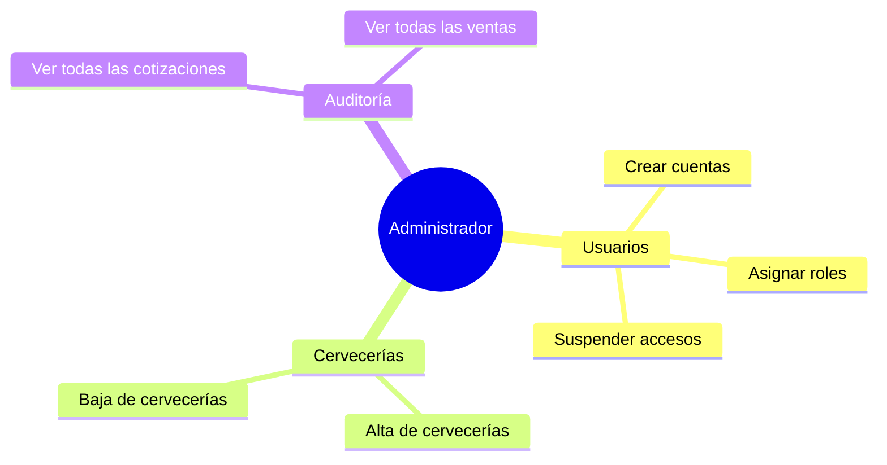
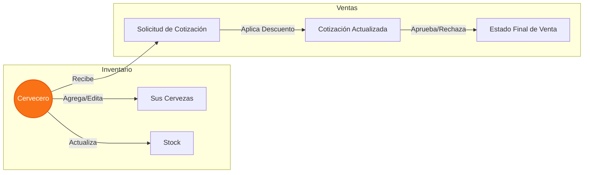
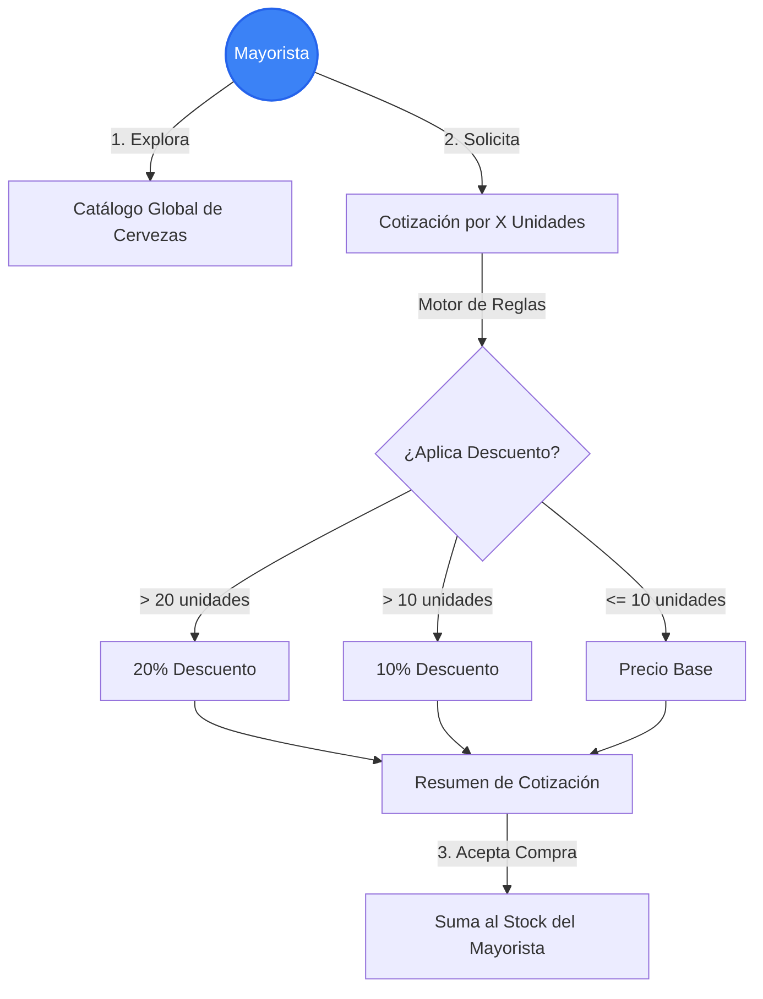

# Roles y Casos de Uso del Sistema

Este documento describe detalladamente los roles existentes en el sistema de la Cervecería, sus responsabilidades, y los casos de uso específicos a los que cada uno tiene acceso.

> [!TIP]
> Los permisos en la API están protegidos por el atributo `[Authorize(Roles = "...")]` en los controladores, garantizando que cada usuario solo acceda a los recursos que le corresponden.

---

## 👥 Resumen de Roles

| Rol | Descripción Principal | Nivel de Acceso |
| :--- | :--- | :--- |
| 👑 **Administrador** | Administrador global del sistema. | **Total**. Acceso a todas las entidades y configuraciones del sistema. |
| 🍺 **Cervecero** | Productor de cerveza. Dueño de una cervecería. | **Medio**. Gestiona su propia producción, cervezas y responde a cotizaciones. |
| 🏪 **Mayorista** | Comprador mayorista de cerveza. | **Básico**. Consulta stock, solicita cotizaciones y gestiona sus compras. |

---

## 1. 👑 Rol: Administrador (Admin)

El Administrador tiene el control total sobre la plataforma. Su función principal es dar mantenimiento a los catálogos principales y gestionar los accesos.

### Casos de Uso (Admin)

- **Gestión de Usuarios:** Crear, editar, suspender o eliminar cuentas de cualquier rol.
- **Gestión del Catálogo Global:** Aprobar nuevas cervecerías, editar tipos de cerveza globales.
- **Supervisión de Transacciones:** Ver todas las cotizaciones y ventas realizadas en el sistema (solo lectura o auditoría).

---

## 2. 🍺 Rol: Cervecero (Brewer)

El Cervecero representa a la fábrica. Su objetivo en el sistema es gestionar su inventario de cervezas y venderle a los mayoristas.

> [!WARNING]
> Un Cervecero **no puede** ver los datos, inventarios ni ventas de otras cervecerías competidoras. Su vista está restringida a su propio `BreweryId`.

### Casos de Uso (Cervecero)

- **Gestión de Cervezas:** Agregar nuevas cervezas, modificar recetas, cambiar precios, actualizar el stock disponible.
- **Gestión de Cotizaciones (Ventas):** Recibir solicitudes de cotización de los mayoristas, aplicar descuentos (ej. por volumen superior a 10 o 20 unidades), y aprobar o rechazar ventas.
- **Visualización de Dashboard:** Ver estadísticas de sus propias ventas y cervezas más solicitadas.

---

## 3. 🏪 Rol: Mayorista (Wholesaler)

El Mayorista es el cliente principal de las cervecerías. Su objetivo es comprar cerveza en cantidad al mejor precio.

> [!IMPORTANT]
> Un Mayorista no puede modificar el catálogo de cervezas ni los precios base. Solo puede solicitar cotizaciones al sistema, el cual calcula automáticamente si aplica un descuento según las reglas de negocio (ej. +10% de descuento si compra más de 10 unidades, +20% si son más de 20).

### Casos de Uso (Mayorista)

- **Exploración de Catálogo:** Ver la lista de cervezas disponibles y a qué cervecería pertenecen.
- **Solicitud de Cotización (Compras):** Armar un pedido solicitando X cantidad de la Cerveza Y. El sistema le devuelve el precio final con descuentos aplicados.
- **Gestión de su Stock Propio:** Una vez concretada la compra, el sistema suma esa cerveza al inventario propio del mayorista.

---

## ⛔ Matriz de Permisos (Qué NO puede hacer cada uno)

| Acción / Endpoint | Administrador | Cervecero | Mayorista |
| :--- | :---: | :---: | :---: |
| Crear Cuentas (`/api/user`) | ✅ **Sí** | ❌ No | ❌ No |
| Crear Cervecería (`/api/brewery`) | ✅ **Sí** | ❌ No | ❌ No |
| Agregar Cerveza (`/api/beer`) | ✅ **Sí** | ✅ **Sí** (Solo suya) | ❌ No |
| Ver Stock de todas las Cervecerías | ✅ **Sí** | ❌ No | ✅ **Sí** (Catálogo) |
| Solicitar Cotización (`/api/quote`) | ❌ No (No compra) | ❌ No | ✅ **Sí** |
| Agregar Stock a su propio inventario | ❌ No | ✅ **Sí** | ✅ **Sí** (Al comprar) |

---
*Documento generado para facilitar la comprensión de las reglas de negocio y autorización implementadas en el backend de la API.*
