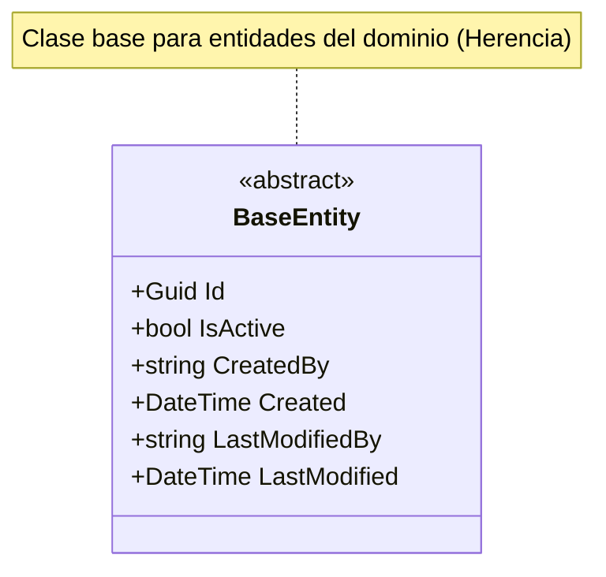

# Análisis UML y Modelo de Datos

Este es el análisis del modelo de datos proporcionado y su representación
en UML utilizando la sintaxis de Mermaid.

## Análisis de Entidades

En el código proporcionado se identifica una **clase base abstracta**:

1. **BaseEntity**: Actúa como la raíz de la jerarquía para otras entidades
   del dominio. Define los atributos comunes de auditoría y el identificador
   principal. Al ser `abstract`, su relación principal con otras entidades
   del sistema será de **Herencia**.

## Diagrama de Clases UML (Mermaid)



## Explicación de las Relaciones y Atributos

* **Herencia**: La clase `BaseEntity` está marcada como `abstract`, lo que
  significa que no se puede instanciar por sí misma y está diseñada para
  que otras entidades (como `User`, `Product`, etc.) hereden de ella.
* **Atributos de Auditoría**:
  * `Id`: Identificador único universal (GUID) y llave primaria.
  * `IsActive`: Flag para borrado lógico.
  * `Created` / `CreatedBy`: Metadatos de creación.
  * `LastModified` / `LastModifiedBy`: Metadatos de seguimiento de cambios.

*Nota: Dado que solo se proporcionó `BaseEntity.cs`, no se visualizan
relaciones One-to-Many o Many-to-Many.*

```mermaid
classDiagram
    %% Definición de Entidades
    class BaseEntity {
        <<abstract>>
        +Guid Id
        +bool IsActive
        +DateTime Created
        +DateTime LastModified
    }

    class User {
        +string Name
        +string Email
        +string PasswordHash
        +string NormalizedUserName
    }

    class Order {
        +Guid UserId
        +DateTime OrderDate
        +decimal TotalAmount
        +string Status
    }

    class OrderDetail {
        +Guid OrderId
        +Guid BeerId
        +int Quantity
        +decimal UnitPrice
    }

    class QuoteRequest {
        +Guid UserId
        +DateTime RequestDate
        +string BeerName
        +int Quantity
        +decimal PricePerUnit
        +string Status
    }

    %% Relaciones de Herencia
    User --|> BaseEntity
    Order --|> BaseEntity
    QuoteRequest --|> BaseEntity

    %% Relaciones de Asociación (One-to-Many)
    Order "1" *-- "many" OrderDetail : contiene
    User "1" *-- "many" Order : realiza
    Order "1" *-- "many" QuoteRequest : tiene
